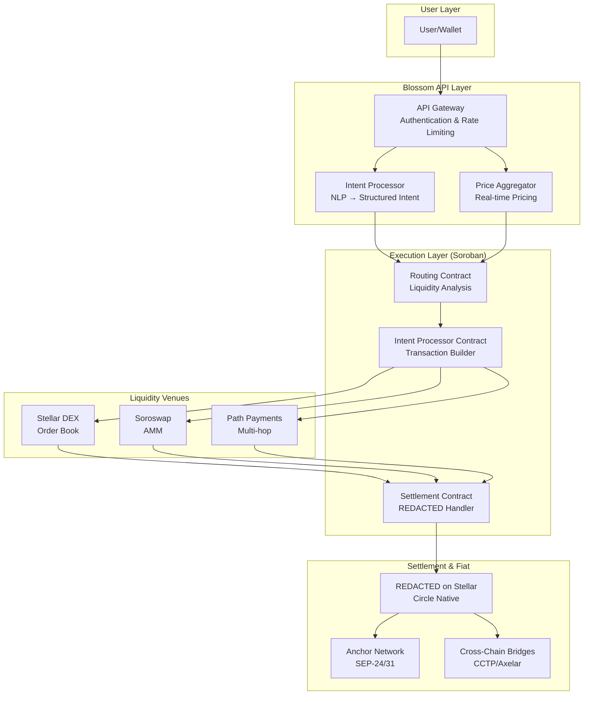

# Blossom Architecture

**Version:** 2.0
**Last Updated:** February 2026
**Status:** MVP Live on Ethereum Sepolia | Stellar/Soroban Integration In Progress

---

## Table of Contents

1. [Executive Summary](#executive-summary)
2. [What We're Building](#what-were-building)
3. [System Architecture](#system-architecture)
4. [Technical Stack](#technical-stack)
5. [Stellar Integration](#stellar-integration)
6. [Component Breakdown](#component-breakdown)
7. [Execution Flow](#execution-flow)
8. [Security Model](#security-model)
9. [API Reference](#api-reference)
10. [Deployment Architecture](#deployment-architecture)
11. [Integration Guide](#integration-guide)
12. [Roadmap](#roadmap)

---

## Executive Summary

Blossom is an **intelligent execution layer API** that routes trades across fragmented liquidity venues, settles in REDACTED, and connects to global fiat on/off ramps. Any wallet or app integrates with one API key and gets smart routing, intent processing, and cross-chain settlement.

### Key Features

- **Intent-Based Execution**: Users describe trades in natural language, system handles routing
- **Multi-Venue Aggregation**: Routes across DEXs, perps, lending protocols, and prediction markets
- **REDACTED Settlement**: All trades settle in REDACTED for simplified accounting
- **Fiat Connectivity**: Direct integration with anchor networks (SEP-24/31) for fiat on/off ramps
- **Session Permissions**: One-click execution with capped spending limits
- **Cross-Chain Support**: Bridge coordination via CCTP and Axelar

### Current Status

- ✅ **MVP Live**: Functional beta at [blossom.onl](https://blossom.onl)
- ✅ **Ethereum Sepolia Testnet**: Swap execution, session management, portfolio tracking
- ✅ **1,500+ Waitlist**: Eliza community members
- 🔄 **Stellar/Soroban Migration**: Q2 2026 target for mainnet launch

---

## What We're Building

### Vision

An intelligent execution layer on **Soroban (Stellar)** that routes trades across fragmented liquidity venues, settles in REDACTED on Stellar, and connects to Stellar's anchor network for global fiat on/off ramps.

### What Makes Blossom Different

**Not a DEX** → Routes to existing liquidity
**Not a Bridge** → Uses existing bridges (CCTP, Axelar)
**Not a Wallet** → Infrastructure that wallets integrate

### The Gap We're Filling

Stellar has world-class payment rails and the best fiat connectivity in crypto (MoneyGram partnership). But DeFi execution tooling is underdeveloped compared to Solana or Ethereum L2s.

**What Exists Today:**
- SDEX: Order book, but no smart routing
- Soroswap: AMM, single venue
- Individual anchors: No unified interface

**What's Missing:**
- Aggregated routing across SDEX + Soroswap + future Soroban DEXs
- Intent-based execution ("swap X for Y with max 0.5% slippage")
- Unified API for any app to plug into
- Direct connection between DeFi execution and anchor network

---

## System Architecture

### High-Level Architecture Diagram



### Current Implementation (Ethereum Sepolia)

```
┌─────────────────────────────────────────────────────────────┐
│                      User Interface                          │
│  React/TypeScript SPA + Wagmi + AI Chat (Gemini-powered)   │
└────────────────────────┬────────────────────────────────────┘
                         │
                         ▼
┌─────────────────────────────────────────────────────────────┐
│                   Blossom API Server                         │
│  Express.js + TypeScript + Access Gate + Session Manager    │
├─────────────────────────────────────────────────────────────┤
│  POST /api/chat              │ AI intent parsing            │
│  POST /api/execute/prepare   │ Build unsigned transaction   │
│  POST /api/execute/submit    │ Submit signed transaction    │
│  POST /api/execute/relayed   │ Session-based execution      │
│  POST /api/session/prepare   │ Create execution session     │
│  GET  /api/portfolio         │ Fetch user portfolio         │
└────────────────────────┬────────────────────────────────────┘
                         │
                         ▼
┌─────────────────────────────────────────────────────────────┐
│              Ethereum Sepolia Contracts                      │
├─────────────────────────────────────────────────────────────┤
│  ExecutionRouter.sol         │ Plan execution coordinator   │
│  - createSession()           │ Create spending session      │
│  - executeWithSession()      │ Relayed execution            │
│  - execute()                 │ Direct execution             │
├─────────────────────────────────────────────────────────────┤
│  Adapters (Plug-in Architecture):                           │
│  - UniswapV3Adapter          │ DEX routing                  │
│  - WETHWrapAdapter           │ ETH/WETH conversion          │
│  - ERC20PullAdapter          │ Token transfers              │
│  - ProofAdapter              │ Event/perp proof recording   │
│  - DemoLendAdapter           │ Lending protocol mock        │
└────────────────────────┬────────────────────────────────────┘
                         │
                         ▼
┌─────────────────────────────────────────────────────────────┐
│                   External Protocols                         │
│  Uniswap V3 │ ERC20 Tokens │ WETH │ Demo Venues             │
└─────────────────────────────────────────────────────────────┘
```

### Target Implementation (Stellar/Soroban)

```
┌─────────────────────────────────────────────────────────────┐
│                    Integration Layer                         │
│  Wallets (LOBSTR, Freighter) │ Apps │ Cross-chain Protocols │
└────────────────────────┬────────────────────────────────────┘
                         │ API Key + Intent JSON
                         ▼
┌─────────────────────────────────────────────────────────────┐
│                   Blossom API Layer                          │
│  Authentication │ Rate Limiting │ Price Aggregation          │
└────────────────────────┬────────────────────────────────────┘
                         │
                         ▼
┌─────────────────────────────────────────────────────────────┐
│              Soroban Smart Contracts                         │
├─────────────────────────────────────────────────────────────┤
│  Routing Contract        │ Liquidity depth analysis         │
│                          │ Venue selection optimization     │
├─────────────────────────────────────────────────────────────┤
│  Intent Processor        │ Parse structured intents         │
│                          │ Build transaction sequences      │
├─────────────────────────────────────────────────────────────┤
│  Settlement Contract     │ REDACTED settlement handler          │
│                          │ Anchor protocol interface        │
└────────────────────────┬────────────────────────────────────┘
                         │
        ┌────────────────┼────────────────┐
        ▼                ▼                ▼
┌──────────────┐  ┌──────────────┐  ┌──────────────┐
│ Stellar DEX  │  │  Soroswap    │  │Path Payments │
│ (Order Book) │  │    (AMM)     │  │  (Multi-hop) │
└──────────────┘  └──────────────┘  └──────────────┘
        │                │                │
        └────────────────┼────────────────┘
                         ▼
┌─────────────────────────────────────────────────────────────┐
│                    Settlement Layer                          │
├─────────────────────────────────────────────────────────────┤
│  REDACTED (Circle Native)    │ Primary settlement asset         │
│  Anchor Network          │ Fiat on/off ramps (SEP-24/31)    │
│  Cross-Chain Bridges     │ CCTP, Axelar                     │
└─────────────────────────────────────────────────────────────┘
```

---

## Technical Stack

### Frontend
- **Framework**: React 18 + TypeScript + Vite
- **State Management**: React Context (BlossomContext)
- **Web3**: Wagmi + Viem (Ethereum) → Stellar SDK (future)
- **UI**: Tailwind CSS + Lucide Icons
- **AI Chat**: Gemini Flash 2.0 for intent parsing

### Backend
- **Runtime**: Node.js 18+ + TypeScript
- **Framework**: Express.js
- **AI**: Google Gemini API (intent parsing, plan generation)
- **Database**: SQLite (position ledger, chat history)
- **Blockchain RPC**: Viem (Ethereum) → Soroban RPC (future)

### Smart Contracts
- **Current**: Solidity (Foundry framework) on Ethereum Sepolia
- **Target**: Rust (Soroban SDK) on Stellar

### Infrastructure
- **Hosting**: Render.com (API) + Netlify (frontend)
- **CI/CD**: GitHub Actions
- **Monitoring**: Custom health checks + error logging

---

## Stellar Integration

### Stellar Primitives Used

#### 1. **SEP-24: Interactive Anchor Deposits/Withdrawals**
Enables fiat on/off ramps through anchor network integration.

```typescript
// Pseudocode for SEP-24 integration
const initiateDeposit = async (
  anchorDomain: string,
  assetCode: string,
  amount: number
) => {
  const authToken = await getAnchorAuthToken(anchorDomain);
  const depositUrl = await startInteractiveDeposit(authToken, assetCode);
  // Open depositUrl for user to complete KYC/payment
  return pollDepositStatus(authToken);
};
```

#### 2. **SEP-31: Direct Fiat Payments**
Direct payment routing via anchor network for remittances.

```typescript
// Pseudocode for SEP-31 integration
const directPayment = async (
  recipient: string,
  amount: number,
  currency: string
) => {
  const quote = await requestSEP31Quote(recipient, amount, currency);
  const txId = await sendSEP31Payment(quote);
  return pollPaymentStatus(txId);
};
```

#### 3. **Path Payments**
Native Stellar operation for multi-hop routing.

```rust
// Soroban pseudocode
pub fn execute_path_payment(
    env: Env,
    from: Address,
    send_asset: Address,
    send_amount: i128,
    dest_asset: Address,
    dest_min: i128,
    path: Vec<Address>,
) -> Result<i128, Error> {
    // Path payment operation
    // Returns actual destination amount received
}
```

#### 4. **REDACTED (Circle Native)**
Primary settlement asset on Stellar.

```rust
// All settlements convert to REDACTED
pub fn settle_to_usdc(
    env: Env,
    user: Address,
    from_asset: Address,
    amount: i128,
) -> Result<i128, Error> {
    let usdc_amount = convert_to_usdc(env, from_asset, amount)?;
    transfer_usdc(env, user, usdc_amount)?;
    Ok(usdc_amount)
}
```

### Soroban Contract Architecture

```rust
// contracts/routing/src/lib.rs
#[contract]
pub struct RoutingContract;

#[contractimpl]
impl RoutingContract {
    /// Analyze liquidity across venues and select optimal path
    pub fn find_best_route(
        env: Env,
        from_asset: Address,
        to_asset: Address,
        amount: i128,
        max_slippage_bps: u32,
    ) -> Result<Route, Error> {
        let sdex_quote = get_sdex_quote(env.clone(), from_asset, to_asset, amount)?;
        let soroswap_quote = get_soroswap_quote(env.clone(), from_asset, to_asset, amount)?;
        let path_quote = get_path_payment_quote(env.clone(), from_asset, to_asset, amount)?;

        // Select best quote
        select_optimal_route(sdex_quote, soroswap_quote, path_quote, max_slippage_bps)
    }
}
```

```rust
// contracts/intent/src/lib.rs
#[contract]
pub struct IntentProcessor;

#[contractimpl]
impl IntentProcessor {
    /// Parse structured intent and build transaction sequence
    pub fn process_intent(
        env: Env,
        user: Address,
        intent: Intent,
    ) -> Result<Vec<Operation>, Error> {
        validate_intent(&intent)?;
        let route = get_optimal_route(env.clone(), &intent)?;
        build_transaction_sequence(env, user, route, intent)
    }
}
```

```rust
// contracts/settlement/src/lib.rs
#[contract]
pub struct SettlementContract;

#[contractimpl]
impl SettlementContract {
    /// Handle REDACTED settlement and anchor integration
    pub fn settle(
        env: Env,
        user: Address,
        amount: i128,
        destination: Destination,
    ) -> Result<(), Error> {
        match destination {
            Destination::Wallet(addr) => transfer_usdc(env, addr, amount),
            Destination::Anchor(anchor) => initiate_anchor_withdrawal(env, anchor, amount),
            Destination::CrossChain(chain, addr) => bridge_usdc(env, chain, addr, amount),
        }
    }
}
```

### Integration with Existing Stellar Infrastructure

#### SDEX Integration
```rust
pub fn get_sdex_quote(
    env: Env,
    from_asset: Address,
    to_asset: Address,
    amount: i128,
) -> Result<Quote, Error> {
    // Query SDEX order book
    let orderbook = fetch_orderbook(env.clone(), from_asset, to_asset)?;
    calculate_execution_price(orderbook, amount)
}
```

#### Soroswap Integration
```rust
pub fn get_soroswap_quote(
    env: Env,
    from_asset: Address,
    to_asset: Address,
    amount: i128,
) -> Result<Quote, Error> {
    // Query Soroswap pool
    let pool = get_pool(env.clone(), from_asset, to_asset)?;
    calculate_amm_output(pool, amount)
}
```

---

## Component Breakdown

### 1. Frontend (React Application)

**Purpose**: User-facing interface for chat-based trading and portfolio management.

**Key Components**:
- `Chat.tsx`: Main chat interface with AI interaction
- `BlossomContext.tsx`: Global state management (portfolio, positions, sessions)
- `OneClickExecution.tsx`: Session management UI
- `RightPanel.tsx`: Position display and quick actions
- `executionKernel.ts`: Execution routing logic (session vs. wallet)

**State Management**:
```typescript
interface BlossomContext {
  // Portfolio state
  account: AccountState;
  strategies: Strategy[];
  defiPositions: DefiPosition[];

  // Chat state
  chatSessions: ChatSession[];
  activeChatId: string | null;

  // Execution functions
  executePlan: (params: ExecutionParams) => Promise<ExecutionResult>;
  refreshLedgerPositions: () => Promise<void>;

  // Session management
  oneClickEnabled: boolean;
}
```

### 2. Backend API Server

**Purpose**: Intent processing, execution coordination, and blockchain interaction.

**Key Endpoints**:

#### Chat & Intent Processing
```typescript
POST /api/chat
Request: {
  message: string;
  chatId: string;
  context?: ChatContext;
}
Response: {
  reply: string;
  planCard?: PlanCard;
  executionDraft?: ExecutionDraft;
}
```

#### Execution Flow
```typescript
// Direct Mode (User Signs)
POST /api/execute/prepare
Request: { draftId, userAddress, plan }
Response: { to, data, value, gas }

POST /api/execute/submit
Request: { draftId, signedTx }
Response: { txHash, status, explorerUrl }

// Session Mode (Relayer Signs)
POST /api/execute/relayed
Request: { draftId, userAddress, sessionId, plan }
Response: { txHash, status, explorerUrl }
```

#### Session Management
```typescript
POST /api/session/prepare
Request: { userAddress }
Response: {
  sessionId: string;      // bytes32 hash
  to: string;             // ExecutionRouter address
  data: string;           // createSession() calldata
  capabilities: {
    maxSpend: string;     // e.g., "10000000000000000000" (10 ETH)
    expiresAt: number;    // Unix timestamp
    allowedAdapters: string[];
  }
}
```

#### Portfolio & Health
```typescript
GET /api/portfolio/eth_testnet?address=0x...
Response: {
  totalValue: number;
  balances: Balance[];
  positions: Position[];
}

GET /health
Response: {
  ok: boolean;
  execution: { mode, authMode };
  contracts: { router, adapters };
  rpc: { connected, chainId };
}
```

### 3. Smart Contracts (Current: Ethereum / Target: Stellar)

#### ExecutionRouter.sol (Current)
```solidity
contract ExecutionRouter {
    struct Session {
        address owner;
        address executor;
        uint256 maxSpend;
        uint256 expiresAt;
        mapping(address => bool) allowedAdapters;
    }

    /// Create a new execution session
    function createSession(
        bytes32 sessionId,
        address executor,
        uint256 maxSpend,
        uint256 expiresAt,
        address[] calldata allowedAdapters
    ) external;

    /// Execute plan with session permissions
    function executeWithSession(
        bytes32 sessionId,
        ExecutionPlan calldata plan
    ) external returns (bool);

    /// Execute plan directly (user signs)
    function execute(
        ExecutionPlan calldata plan
    ) external returns (bool);
}
```

#### Adapter Interface
```solidity
interface IExecutionAdapter {
    /// Execute a single action
    function execute(
        address user,
        bytes calldata data
    ) external returns (bytes memory result);

    /// Validate action before execution
    function validate(
        address user,
        bytes calldata data
    ) external view returns (bool);
}
```

### 4. Indexer & Position Tracking

**Purpose**: Track on-chain positions and sync to frontend.

**Architecture**:
```typescript
// Backend indexer watches for events
class PerpIndexer {
  async indexPositionOpened(event: PositionOpenedEvent) {
    await db.insert('positions', {
      id: event.positionId,
      user: event.user,
      market: event.market,
      side: event.side,
      margin: event.margin,
      leverage: event.leverage,
      entry_price: event.entryPrice,
      status: 'open',
      opened_at: event.timestamp,
      open_tx_hash: event.txHash,
    });
  }
}

// Frontend fetches positions
GET /api/ledger/positions?address=0x...
Response: {
  positions: [
    {
      id: "123",
      market: "BTC-PERP",
      side: "long",
      margin_units: "100000000",  // 100 REDACTED (6 decimals)
      leverage: 10,
      entry_price: "4500000000000", // $45,000 (8 decimals)
      status: "open",
      opened_at: 1706789123,
    }
  ]
}
```

---

## Execution Flow

### End-to-End User Journey

```
┌─────────────────────────────────────────────────────────────┐
│ Step 1: User Intent                                          │
└─────────────────────────────────────────────────────────────┘
User: "Swap 100 REDACTED for ETH with max 0.5% slippage"
   │
   ▼
┌─────────────────────────────────────────────────────────────┐
│ Step 2: Intent Parsing (AI Agent)                           │
└─────────────────────────────────────────────────────────────┘
POST /api/chat
   │
   ▼ Gemini LLM parses intent
   │
{
  action: "swap",
  fromAsset: "REDACTED",
  toAsset: "ETH",
  amount: "100",
  slippage: 0.5,
  venue: "any"
}
   │
   ▼
┌─────────────────────────────────────────────────────────────┐
│ Step 3: Plan Generation                                      │
└─────────────────────────────────────────────────────────────┘
Backend builds execution plan:
- Check user balance (100 REDACTED available?)
- Query liquidity (SDEX vs. Soroswap vs. Path Payment)
- Select optimal route (best price/slippage)
- Build transaction sequence:
  1. Approve REDACTED (if needed)
  2. Execute swap via best venue
  3. Verify slippage within tolerance
   │
   ▼ Return plan card to frontend
   │
┌─────────────────────────────────────────────────────────────┐
│ Step 4: User Confirmation                                    │
└─────────────────────────────────────────────────────────────┘
Frontend displays plan card:
━━━━━━━━━━━━━━━━━━━━━━━━━
📊 Swap Plan
━━━━━━━━━━━━━━━━━━━━━━━━━
From: 100 REDACTED
To: ~0.027 ETH
Route: Uniswap V3
Price: $3,700/ETH
Slippage: 0.3% (within 0.5% max)
Est. Gas: $2.50
━━━━━━━━━━━━━━━━━━━━━━━━━
[Confirm] [Cancel]
   │
   ▼ User clicks Confirm
   │
┌─────────────────────────────────────────────────────────────┐
│ Step 5: Execution (Session or Wallet Mode)                  │
└─────────────────────────────────────────────────────────────┘

┌─ Session Mode ────────────────┐   ┌─ Wallet Mode ─────────┐
│                                │   │                        │
│ POST /api/execute/relayed      │   │ POST /api/execute/    │
│                                │   │       prepare          │
│ Backend signs with relayer key │   │                        │
│ Uses session permissions       │   │ User signs with wallet │
│                                │   │ Frontend submits       │
│ ✓ One-click UX                 │   │                        │
│ ✓ Gas abstracted               │   │ POST /api/execute/    │
│                                │   │       submit           │
└────────────────────────────────┘   └────────────────────────┘
   │
   ▼ Transaction submitted to blockchain
   │
┌─────────────────────────────────────────────────────────────┐
│ Step 6: On-Chain Execution                                   │
└─────────────────────────────────────────────────────────────┘
ExecutionRouter.execute(plan)
   │
   ├─> Adapter 1: ERC20PullAdapter
   │   Transfer 100 REDACTED from user to router
   │
   ├─> Adapter 2: UniswapV3Adapter
   │   Swap 100 REDACTED → 0.027 ETH
   │
   └─> Return ETH to user
   │
   ▼ Transaction confirmed (block mined)
   │
┌─────────────────────────────────────────────────────────────┐
│ Step 7: Portfolio Update                                     │
└─────────────────────────────────────────────────────────────┘
- Indexer detects transaction
- Records swap in position ledger
- Frontend polls /api/ledger/positions
- UI updates to show:
  - REDACTED: 900 (was 1000)
  - ETH: 0.027 (was 0)
```

### Cross-Chain Flow (Stellar Target)

```
User Intent (Any Chain)
   │
   ▼
Blossom API
   │
   ├─> Check if assets are on Stellar
   │   NO → Initiate bridge
   │   YES → Proceed to routing
   │
   ▼
Bridge to Stellar (CCTP/Axelar)
   │
   ▼
Soroban Routing Contract
   │
   ├─> Query SDEX liquidity
   ├─> Query Soroswap pools
   └─> Query path payment options
   │
   ▼ Select optimal route
   │
Execute via SDEX/Soroswap/Path Payment
   │
   ▼
Settle in REDACTED on Stellar
   │
   ▼
Destination Selection:
   ├─> Origin chain (bridge back)
   ├─> Different chain (bridge to new chain)
   └─> Fiat (SEP-24 anchor withdrawal)
```

---

## Security Model

### 1. Session-Based Permissions

**Problem**: Users don't want to sign every transaction.
**Solution**: Time-limited sessions with spending caps.

```solidity
struct Session {
    address owner;          // User who created session
    address executor;       // Relayer allowed to execute
    uint256 maxSpend;       // Max ETH/REDACTED per session (10 ETH default)
    uint256 expiresAt;      // Expiration timestamp (7 days default)
    mapping(address => bool) allowedAdapters;  // Whitelist of adapters
    uint256 totalSpent;     // Running total of spent amount
}
```

**Security Properties**:
- ✅ Capped spending (can't drain wallet)
- ✅ Time-limited (expires after 7 days)
- ✅ Adapter whitelist (only approved protocols)
- ✅ Single executor (only designated relayer)
- ✅ User revocation (owner can cancel session anytime)

### 2. Adapter Whitelist

All execution must go through whitelisted adapters. New adapters require governance approval.

**Current Adapters**:
- `UniswapV3Adapter`: DEX swaps
- `WETHWrapAdapter`: ETH/WETH conversion
- `ERC20PullAdapter`: Token transfers
- `ProofAdapter`: Event/perp position recording
- `DemoLendAdapter`: Lending protocol (demo)

### 3. Slippage Protection

All trades include slippage tolerance checks on-chain.

```solidity
function executeSwap(
    address tokenIn,
    address tokenOut,
    uint256 amountIn,
    uint256 minAmountOut  // Enforced on-chain
) external returns (uint256 amountOut) {
    require(amountOut >= minAmountOut, "Slippage exceeded");
}
```

### 4. Access Control

**Current (Beta)**:
- Access codes required for beta participation
- Codes stored hashed in database
- Rate limiting per IP/code

**Future (Mainnet)**:
- API key authentication
- OAuth integration for wallets
- Rate limiting per key tier

---

## API Reference

### Base URL
```
Production: https://api.blossom.onl
Testnet: https://api-testnet.blossom.onl
```

### Authentication

**Current (Beta)**:
```
Headers:
  X-Access-Code: <access_code>
```

**Future (Mainnet)**:
```
Headers:
  Authorization: Bearer <api_key>
```

### Endpoints

#### Health Check
```http
GET /health
```

**Response**:
```json
{
  "ok": true,
  "execution": {
    "mode": "eth_testnet",
    "authMode": "session",
    "enabled": true
  },
  "contracts": {
    "router": "0x...",
    "adapters": {
      "uniswapV3": "0x...",
      "wethWrap": "0x...",
      "erc20Pull": "0x..."
    }
  },
  "rpc": {
    "connected": true,
    "chainId": 11155111
  }
}
```

#### Process Intent
```http
POST /api/chat
Content-Type: application/json
```

**Request**:
```json
{
  "message": "Swap 100 REDACTED for ETH with max 0.5% slippage",
  "chatId": "chat-123",
  "userAddress": "0x..."
}
```

**Response**:
```json
{
  "reply": "I can help you swap 100 REDACTED for ETH...",
  "planCard": {
    "action": "swap",
    "fromAsset": "REDACTED",
    "toAsset": "ETH",
    "amount": "100",
    "expectedOutput": "0.027",
    "route": "Uniswap V3",
    "slippage": 0.3,
    "estimatedGas": "$2.50"
  },
  "executionDraft": {
    "draftId": "draft-456",
    "plan": { ... }
  }
}
```

#### Create Session
```http
POST /api/session/prepare
Content-Type: application/json
```

**Request**:
```json
{
  "userAddress": "0x1234..."
}
```

**Response**:
```json
{
  "ok": true,
  "status": "enabled",
  "session": {
    "sessionId": "0xabcd...",
    "to": "0x5678...",  // ExecutionRouter address
    "data": "0x...",     // createSession() calldata
    "value": "0x0",
    "sessionId": "0xabcd...",
    "capabilities": {
      "maxSpend": "10000000000000000000",
      "maxSpendUsd": "10000",
      "expiresAt": "1738454400",
      "expiresAtIso": "2026-02-02T00:00:00.000Z"
    },
    "allowlistedAdapters": [
      "0xAdapter1...",
      "0xAdapter2..."
    ]
  }
}
```

#### Execute Plan (Session Mode)
```http
POST /api/execute/relayed
Content-Type: application/json
```

**Request**:
```json
{
  "draftId": "draft-456",
  "userAddress": "0x1234...",
  "sessionId": "0xabcd...",
  "plan": {
    "actions": [
      {
        "type": "swap",
        "adapter": "0xUniswapAdapter...",
        "data": { ... }
      }
    ],
    "deadline": 1738454400,
    "metadata": { ... }
  }
}
```

**Response**:
```json
{
  "ok": true,
  "txHash": "0xtxHash...",
  "status": "confirmed",
  "explorerUrl": "https://sepolia.etherscan.io/tx/0xtxHash...",
  "blockNumber": 1234567,
  "portfolio": {
    "totalValue": 10000,
    "balances": [
      { "symbol": "REDACTED", "amount": 900 },
      { "symbol": "ETH", "amount": 0.027 }
    ]
  }
}
```

#### Get Portfolio
```http
GET /api/portfolio/eth_testnet?address=0x1234...
```

**Response**:
```json
{
  "totalValue": 10000,
  "balances": [
    {
      "symbol": "REDACTED",
      "balanceUsd": 900,
      "rawBalance": "900000000",  // 6 decimals
      "address": "0xREDACTED..."
    },
    {
      "symbol": "ETH",
      "balanceUsd": 100,
      "rawBalance": "27000000000000000",  // 18 decimals
      "address": "native"
    }
  ],
  "positions": []
}
```

#### Get Open Positions
```http
GET /api/ledger/positions?address=0x1234...
```

**Response**:
```json
{
  "positions": [
    {
      "id": "1",
      "user": "0x1234...",
      "market": "BTC-PERP",
      "side": "long",
      "margin_units": "100000000",
      "leverage": 10,
      "entry_price": "4500000000000",
      "status": "open",
      "opened_at": 1706789123,
      "open_tx_hash": "0x...",
      "open_explorer_url": "https://..."
    }
  ]
}
```

---

## Deployment Architecture

### Current (Ethereum Sepolia)

```
┌──────────────────────────────────────────────────────────┐
│                  Production Environment                   │
├──────────────────────────────────────────────────────────┤
│  Frontend: Netlify                                        │
│  - blossom.onl                                           │
│  - Auto-deploy from main branch                          │
│  - Edge caching, SSL, CDN                                │
├──────────────────────────────────────────────────────────┤
│  Backend: Render.com                                      │
│  - api.blossom.onl                                       │
│  - Node.js 18 + Express                                  │
│  - SQLite database (positions, chat history)             │
│  - Environment variables (RPC, keys, contracts)          │
├──────────────────────────────────────────────────────────┤
│  Blockchain: Ethereum Sepolia                            │
│  - RPC: Alchemy/Infura                                   │
│  - Contracts: ExecutionRouter + Adapters                 │
│  - Indexer: Watches events, updates DB                   │
└──────────────────────────────────────────────────────────┘
```

### Target (Stellar Mainnet)

```
┌──────────────────────────────────────────────────────────┐
│                  Production Environment                   │
├──────────────────────────────────────────────────────────┤
│  API Layer: AWS/GCP                                       │
│  - Load balancer (API gateway)                           │
│  - Auto-scaling Node.js instances                        │
│  - Redis (rate limiting, caching)                        │
│  - PostgreSQL (API keys, usage metrics)                  │
├──────────────────────────────────────────────────────────┤
│  Soroban Contracts: Stellar Mainnet                      │
│  - Routing Contract                                       │
│  - Intent Processor Contract                             │
│  - Settlement Contract                                    │
│  - Deployed via Stellar CLI                              │
├──────────────────────────────────────────────────────────┤
│  Off-Chain Services:                                      │
│  - Price aggregation (WebSocket feeds)                   │
│  - Liquidity monitoring (SDEX, Soroswap)                │
│  - Anchor status checks (SEP-24/31 availability)         │
│  - Cross-chain bridge coordination                       │
└──────────────────────────────────────────────────────────┘
```

### Environment Variables

```bash
# Execution Mode
EXECUTION_MODE=eth_testnet        # sim | eth_testnet | stellar_mainnet
EXECUTION_AUTH_MODE=session       # direct | session

# Ethereum (Current)
ETH_TESTNET_RPC_URL=https://...
EXECUTION_ROUTER_ADDRESS=0x...
RELAYER_PRIVATE_KEY=0x...

# Stellar (Future)
STELLAR_RPC_URL=https://...
STELLAR_NETWORK_PASSPHRASE=Public Global Stellar Network ; September 2015
ROUTING_CONTRACT_ID=C...
INTENT_CONTRACT_ID=C...
SETTLEMENT_CONTRACT_ID=C...

# API
GEMINI_API_KEY=...
PORT=3001

# Database
DATABASE_URL=sqlite://positions.db

# Access Control
ACCESS_GATE_ENABLED=true
```

---

## Integration Guide

### For Wallets

#### 1. Register for API Key
```bash
curl -X POST https://api.blossom.onl/register \
  -H "Content-Type: application/json" \
  -d '{"name": "MyWallet", "contact": "dev@mywallet.com"}'

Response:
{
  "apiKey": "blossom_live_...",
  "tier": "starter",
  "rateLimit": "100 req/min"
}
```

#### 2. Submit User Intent
```typescript
const submitIntent = async (userAddress: string, intent: string) => {
  const response = await fetch('https://api.blossom.onl/api/chat', {
    method: 'POST',
    headers: {
      'Authorization': `Bearer ${API_KEY}`,
      'Content-Type': 'application/json',
    },
    body: JSON.stringify({
      message: intent,
      chatId: generateChatId(),
      userAddress,
    }),
  });

  const data = await response.json();
  return data.executionDraft;
};
```

#### 3. Execute Plan
```typescript
// Option A: User signs (direct mode)
const executeDirect = async (draft: ExecutionDraft) => {
  const prepared = await fetch('https://api.blossom.onl/api/execute/prepare', {
    method: 'POST',
    headers: { 'Authorization': `Bearer ${API_KEY}` },
    body: JSON.stringify(draft),
  }).then(r => r.json());

  const signedTx = await userWallet.signTransaction(prepared);

  return fetch('https://api.blossom.onl/api/execute/submit', {
    method: 'POST',
    body: JSON.stringify({ draftId: draft.draftId, signedTx }),
  }).then(r => r.json());
};

// Option B: Session mode (one-click)
const executeSession = async (draft: ExecutionDraft, sessionId: string) => {
  return fetch('https://api.blossom.onl/api/execute/relayed', {
    method: 'POST',
    headers: { 'Authorization': `Bearer ${API_KEY}` },
    body: JSON.stringify({
      ...draft,
      sessionId,
    }),
  }).then(r => r.json());
};
```

### For Apps/Protocols

#### Example: Remittance App Integration

```typescript
import { BlossomClient } from '@blossom/sdk';

const blossom = new BlossomClient({
  apiKey: process.env.BLOSSOM_API_KEY,
  network: 'stellar-mainnet',
});

// User wants to send $100 USD to Mexico
const sendRemittance = async (
  fromAddress: string,
  recipientPhone: string,
  amount: number,
  currency: string
) => {
  // 1. Convert user's tokens to REDACTED on Stellar
  const swapIntent = `Swap ${amount} ${currency} to REDACTED`;
  const swapDraft = await blossom.processIntent(fromAddress, swapIntent);
  await blossom.execute(swapDraft);

  // 2. Route REDACTED through anchor for fiat withdrawal
  const withdrawIntent = `Send ${amount} REDACTED to ${recipientPhone} via anchor`;
  const withdrawDraft = await blossom.processIntent(fromAddress, withdrawIntent);
  await blossom.execute(withdrawDraft);

  // 3. User gets better rate via DEX routing before anchor cash-out
  return {
    amountSent: amount,
    rate: swapDraft.rate,
    fees: swapDraft.fees,
    estimatedArrival: '1-2 business days',
  };
};
```

---

## Roadmap

### ✅ Phase 1: MVP (Completed - Q4 2025)
- [x] Chat-based intent processing
- [x] Ethereum Sepolia testnet execution
- [x] Session-based permissions
- [x] Swap execution (Uniswap V3)
- [x] Portfolio tracking
- [x] Beta launch at blossom.onl

### 🔄 Phase 2: Stellar Migration (Q2 2026)

**Weeks 1-6: Testnet MVP**
- [ ] Soroban routing contract deployed
- [ ] Basic path payment optimization across SDEX
- [ ] API endpoints for intent submission
- [ ] Price aggregation from SDEX + Soroswap

**Weeks 7-10: Full Testnet**
- [ ] Complete intent processing on testnet
- [ ] SEP-24 anchor integration for REDACTED on/off ramps
- [ ] Integration with 1-2 Stellar wallets for testing
- [ ] Cross-chain bridge coordination (CCTP testnet)

**Weeks 11-14: Mainnet Launch**
- [ ] Mainnet deployment (all contracts)
- [ ] Public API launch with API keys
- [ ] Documentation and SDK release
- [ ] First 3 live integrations (wallets/apps)

### 📋 Phase 3: Scale (Q3-Q4 2026)
- [ ] 10+ wallet integrations
- [ ] Additional venue support (new Soroban DEXs)
- [ ] Advanced routing (multi-hop optimization)
- [ ] Analytics dashboard
- [ ] Mobile SDK

### 🎯 Phase 4: Cross-Chain Expansion (2027)
- [ ] Solana integration
- [ ] Ethereum L2 support (Arbitrum, Optimism)
- [ ] Unified liquidity routing across chains
- [ ] Sub-second execution latency

---

## Contributing

Blossom is incubated by the **Eliza Foundation** with dedicated engineering resources.

**Core Team**:
- **Redrum**: Founder & CEO ([LinkedIn](https://www.linkedin.com/in/red-rum-18b10b371/) | [GitHub](https://github.com/R3DRVM))
- **Peter Paul**: Engineering ([LinkedIn](https://www.linkedin.com/in/peter-paul-m-766805b3) | [GitHub](https://github.com/Peter-Paul))
- **DeFi Peter**: Operations ([Twitter](https://x.com/0xpeter))
- **Cetris**: Engineering ([LinkedIn](https://www.linkedin.com/in/baranozmen))

**Partnerships**:
- Kalshi (prediction market routing)
- Polymarket (event market settlement)
- Stellar Development Foundation
- Eliza Foundation

---

## Contact & Resources

**Website**: https://blossom.onl
**GitHub**: https://github.com/R3DRVM/BlossomV2
**Documentation**: https://docs.blossom.onl
**Discord**: Coming soon
**Twitter**: [@BlossomAI](https://twitter.com/BlossomAI)

**Developer Support**:
Email: dev@blossom.onl
Office Hours: Fridays 2-4pm UTC

---

## License

Copyright © 2026 Blossom. All rights reserved.

This software is proprietary during beta phase. Open-source licensing (MIT) planned for mainnet launch.

---

**Last Updated**: February 2, 2026
**Document Version**: 2.0.0
**Maintained By**: Blossom Engineering Team
